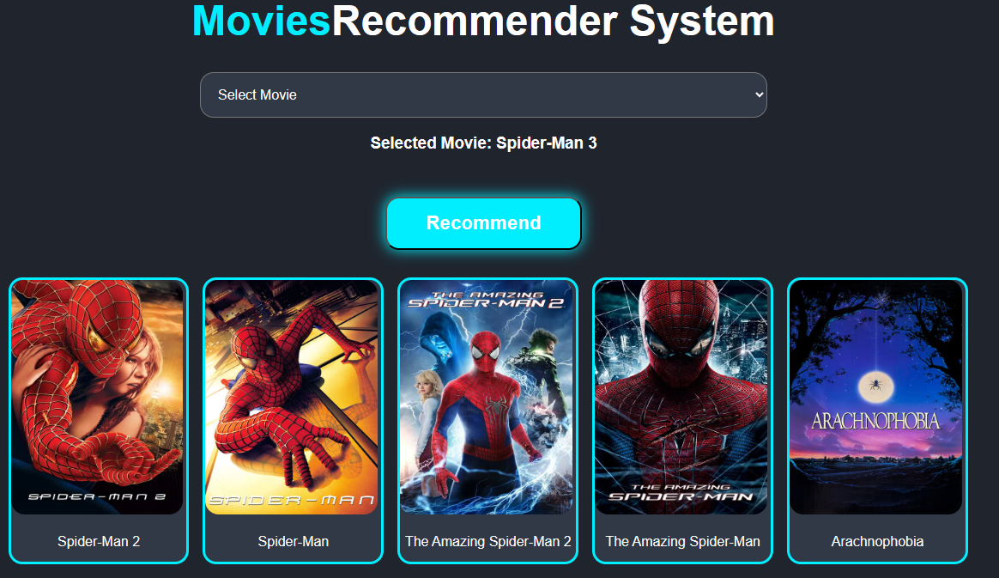

# Movie Recommender System

A simple Django-based web application that recommends movies based on your preferences.



## Making Process

This project was developed using the following steps:

1️⃣. **Data Collection**: Gathered a dataset of movies with relevant features such as genres, keywords, cast, and crew.

2️⃣. **Data Preprocessing**: Cleaned and preprocessed the data to handle missing values, normalize text, and create a unified feature set.

3️⃣. **Feature Engineering**: Combined relevant features into a single 'tags' column and applied text processing techniques like tokenization, stemming, and                  vectorization.

4️⃣. **Model Training**: Used cosine similarity to compute similarities between movies based on their feature vectors.

5️⃣. **Web Development**: Built a user-friendly web interface using Django to allow users to select a movie and get recommendations.

6️⃣. **Deployment**: Deployed the application on a local server for testing and demonstration purposes.

✅ Whole process is done in Jupyter Notebook. see MRS_Notebook.ipynb file for more details.


## Dataset

🔗 Downloaded from Kaggle. link: https://www.kaggle.com/datasets/tmdb/tmdb-movie-metadata

## Features

- Movie recommendations base on slected movie prasent in the database
- Uses cosine similarity for recommendations
- User-friendly interface
- Powered by Django

## Getting Started

Follow these steps to run the project locally.

### Prerequisites

- Python 3.8+
- pip (Python package manager)
- Git

### Installation

1. **Clone the repository:**
    ```bash
    git clone https://github.com/yourusername/MovieRecommenderSystem.git
    cd MovieRecommenderSystem
    ```

2. **Create and activate a virtual environment:**
    ```bash
    python -m venv venv
    # On Windows
    venv\Scripts\activate
    # On macOS/Linux
    source venv/bin/activate
    ```

3. **Install dependencies:**
    ```bash
    pip install -r requirements.txt
    ```

4. **Apply migrations:**
    ```bash
    python manage.py migrate
    ```

5. **Run the development server:**
    ```bash
    python manage.py runserver
    ```

6. **Open your browser and visit:**
    ```
    http://127.0.0.1:8000/
    ```

## Contributing

Pull requests are welcome! For major changes, please open an issue first to discuss what you would like to change.

## License

This project is licensed under the MIT License.

---

Enjoy exploring and recommending movies!
